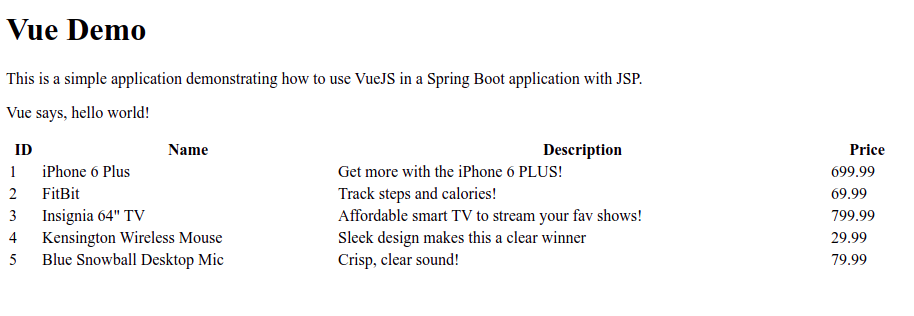

#Spring Boot / VueJS / JSP???

Yes! You can use VueJS in a JSP rendered page! Why? Why? Why would I do such a thing? 

I wanted a **server-side rendered** application using JSP, yet I also wanted some "reactivity" in my application. This application keeps it simple, very simple, yet shows
one method to implement VueJS into your existing JSP pages. **NOTE: This is not a Single Page Application**

I have not been able to build this with any success, so any advice / feedback / suggestions would be greatly appreciated! 

